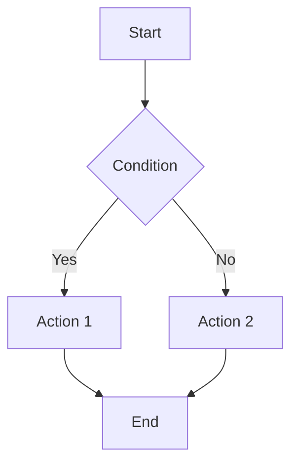
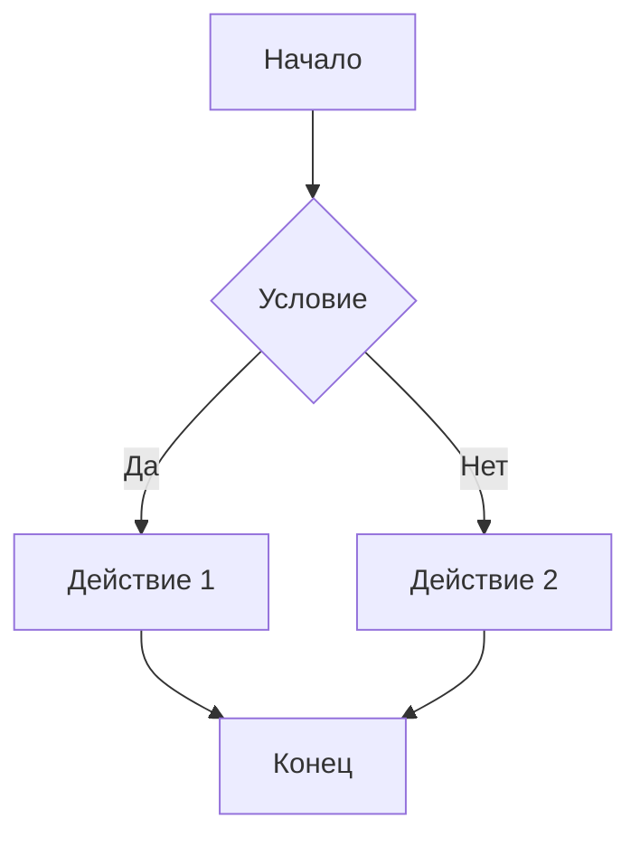

# Markdown to PDF Converter

<div align="center">


**A powerful React application for converting Markdown to PDF with LaTeX math support and Mermaid diagrams**

[🚀 Live Demo](https://markdowntopdf.ru) • [📖 Documentation](https://markdowntopdf.ru) • [🐛 Report Bug](https://github.com/wdst/markdown-pdf/issues) • [✨ Request Feature](https://github.com/wdst/markdown-pdf/issues)

</div>

---

## ✨ Features

- 📝 **Full Markdown Support** - Complete Markdown syntax with tables, lists, links, and code blocks
- 🧮 **LaTeX Math Formulas** - Render mathematical expressions using KaTeX
- 📊 **Mermaid Diagrams** - Create flowcharts, sequence diagrams, and more
- 📄 **PDF Export** - Generate high-quality PDF documents

## 🖼️ Screenshot

<div align="center">
  
</div>

## 🛠️ Tech Stack

<table style="border: none;">
<tr>
<td align="center" width="20%">

<br/>
<sub><b>React 19</b></sub>
</td>
<td align="center" width="20%">

<br/>
<sub><b>Vite</b></sub>
</td>
<td align="center" width="20%">

<br/>
<sub><b>JavaScript</b></sub>
</td>
<td align="center" width="20%">

<br/>
<sub><b>CSS3</b></sub>
</td>
<td align="center" width="20%">

<br/>
<sub><b>HTML5</b></sub>
</td>
</tr>
</table>

### Key Libraries

- **[marked](https://marked.js.org/)** - Fast Markdown parser
- **[KaTeX](https://katex.org/)** - Fast math typesetting
- **[Mermaid](https://mermaid.js.org/)** - Diagram generation
- **[html2pdf.js](https://github.com/eKoopmans/html2pdf.js)** - PDF generation

## 🚀 Quick Start

### Prerequisites

- Node.js (version 16 or higher)
- npm or yarn

### Installation

1. **Clone the repository**
```bash
git clone https://github.com/wdst/markdown-pdf.git
cd markdown-pdf
```

2. **Install dependencies**
```bash
npm install
# or
yarn install
```

3. **Start development server**
```bash
npm run dev
# or
yarn dev
```

4. **Open your browser**
Navigate to `http://localhost:5173`

### Build for Production

```bash
npm run build
# or
yarn build
```

The built files will be in the `dist` directory.

## 📖 Usage

### Basic Markdown
Write your content using standard Markdown syntax:

```markdown
# Heading 1
## Heading 2

**Bold text** and *italic text*

- List item 1
- List item 2

[Link](https://example.com)
```

### Mathematical Formulas

**Inline formulas:**
```markdown
The famous equation: $E = mc^2$
```

**Block formulas:**
```latex
$$
\int_{-\infty}^{\infty} e^{-x^2} dx = \sqrt{\pi}
$$
```

### Mermaid Diagrams

Create various types of diagrams:



### PDF Export

1. Write your Markdown content
2. Click the **"Save to PDF"** button
3. The PDF will be automatically downloaded as `markdown-document.pdf`

## 📝 License

This project is licensed under the MIT License - see the [LICENSE](LICENSE) file for details.

## 🙏 Acknowledgments

- [marked](https://marked.js.org/) - Markdown parser
- [KaTeX](https://katex.org/) - Math typesetting
- [Mermaid](https://mermaid.js.org/) - Diagram generation
- [html2pdf.js](https://github.com/eKoopmans/html2pdf.js) - PDF generation

---

<div align="center">
  <strong>⭐ Star this repository if you found it helpful! ⭐</strong>
</div>

---

# Markdown to PDF Конвертер

React приложение для конвертации Markdown в PDF с поддержкой математических формул LaTeX и диаграмм Mermaid.

## Возможности

- 📝 **Полная поддержка Markdown**: заголовки, списки, таблицы, ссылки, код
- 🧮 **Математические формулы**: поддержка LaTeX через KaTeX
- 📊 **Диаграммы Mermaid**: создание схем, графиков и диаграмм
- 📄 **Экспорт в PDF**: генерация PDF


## Технологии

- **React 19** - пользовательский интерфейс
- **Vite** - сборщик и dev-сервер
- **marked** - парсер Markdown
- **KaTeX** - рендеринг математических формул
- **Mermaid** - создание диаграмм
- **html2pdf.js** - генерация PDF

## Установка и запуск

1. Установите зависимости:
```bash
npm install
```

2. Запустите dev-сервер:
```bash
npm run dev
```

3. Откройте браузер по адресу `http://localhost:5173`

## Сборка для продакшена

```bash
npm run build
```

## Использование


### Математические формулы
- Встроенные формулы: `$E = mc^2$`
- Блочные формулы:
```latex
$$
\int_{-\infty}^{\infty} e^{-x^2} dx = \sqrt{\pi}
$$
```

### Диаграммы Mermaid


### Экспорт в PDF
- Нажмите кнопку "Сохранить в PDF"
- PDF будет автоматически скачан с именем `markdown-document.pdf`

## Лицензия

MIT License