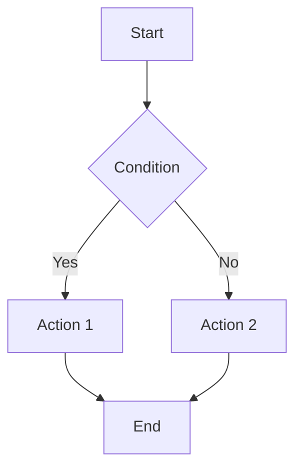
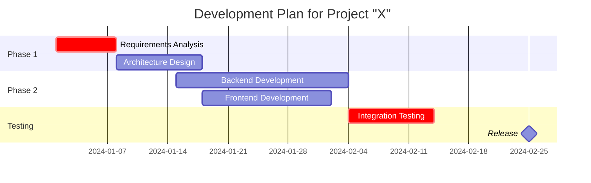
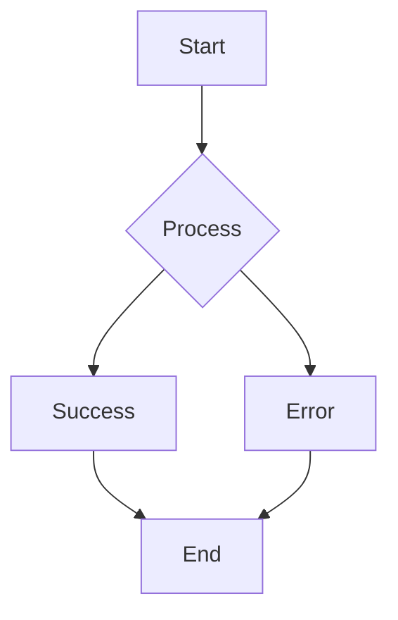
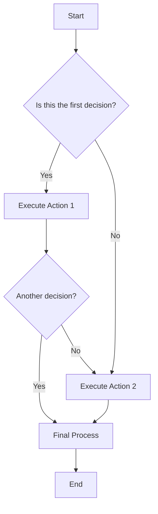
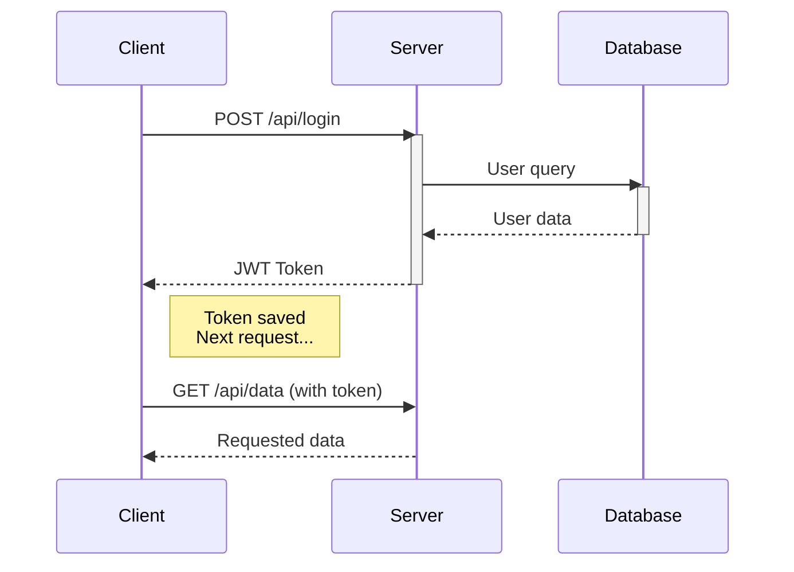
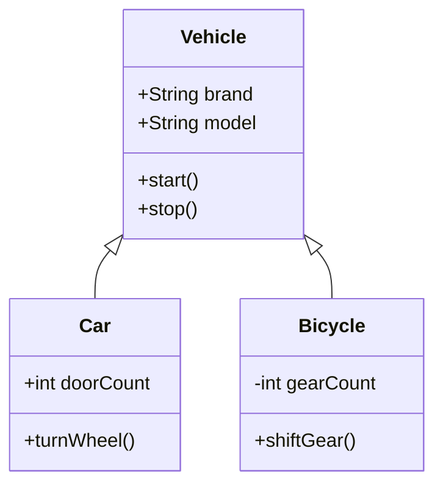
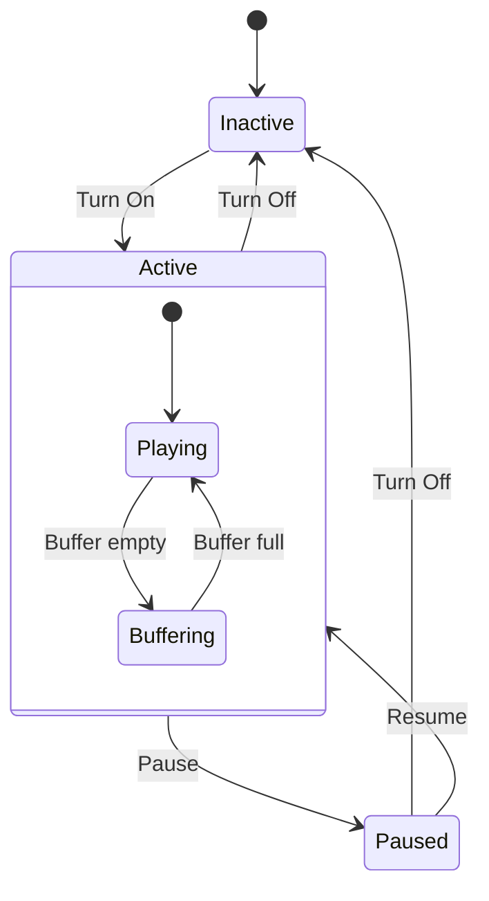
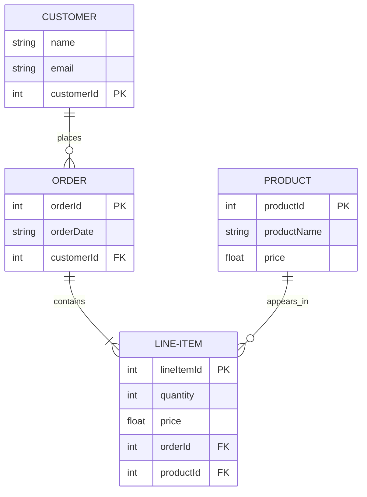
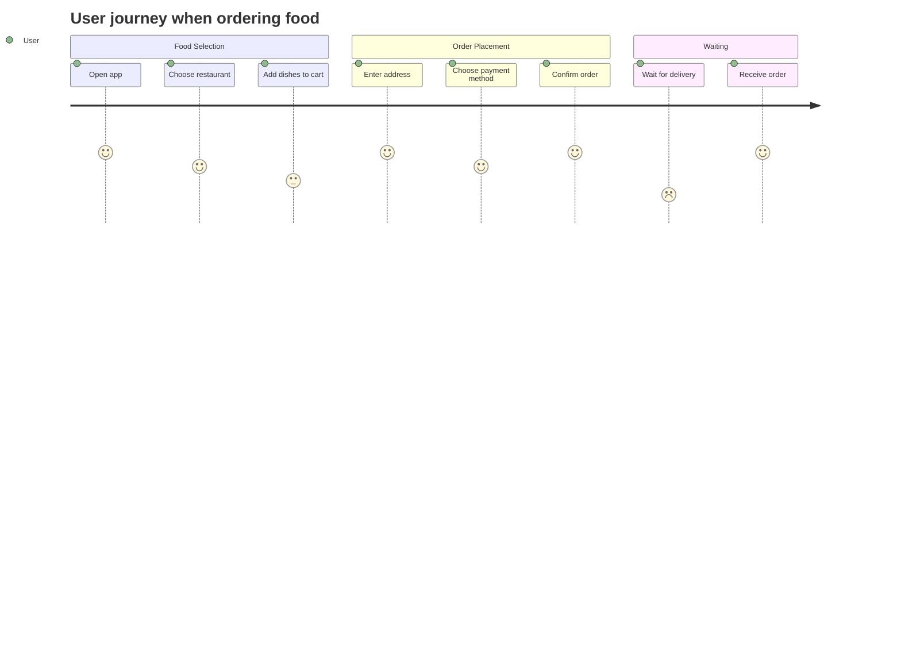
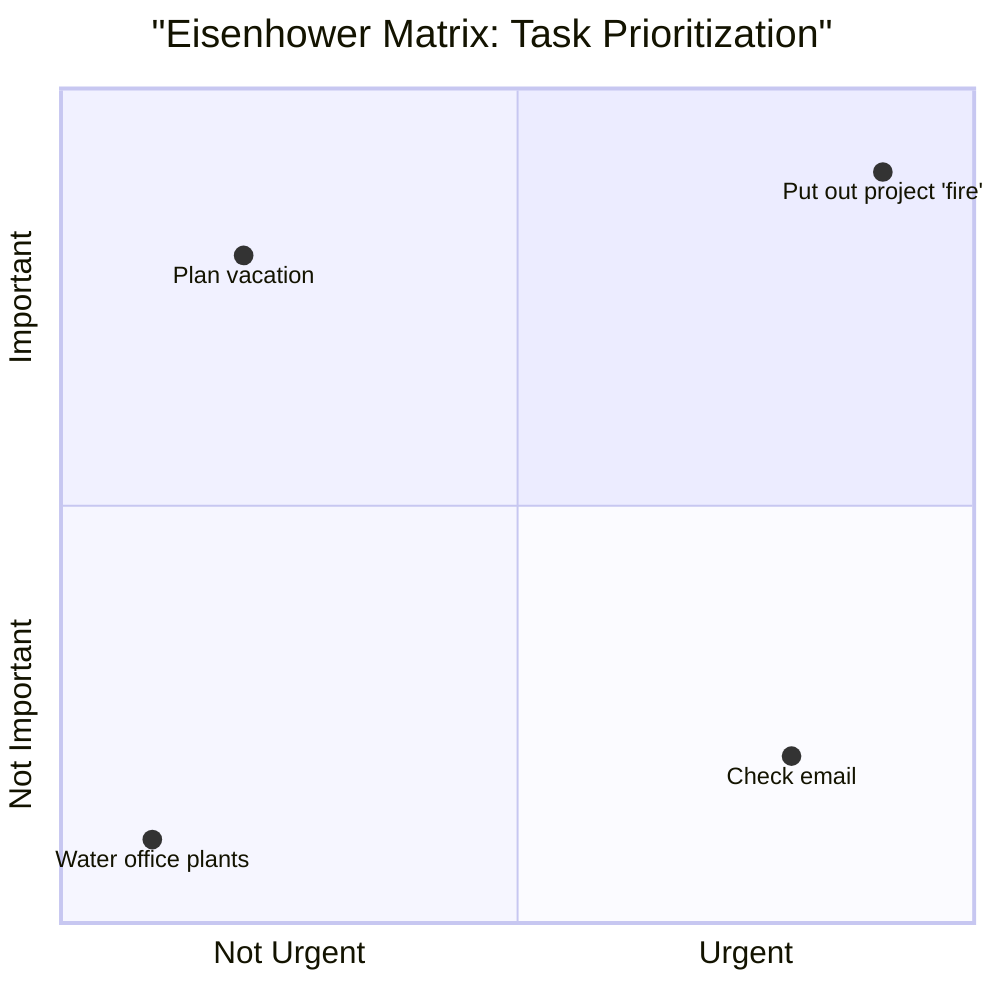

# Welcome to Markdown to PDF Converter!

This is an example Markdown document with support for various elements.

## Mathematical Formulas

Inline formula: $E = mc^2$

Block formula:
$\int_{-\infty}^{\infty} e^{-x^2} dx = \sqrt{\pi}$

## Mermaid Diagrams



## Gantt Diagram

Project planning and timeline tracking.



## Lists and Formatting

- **Bold text**
- *Italic*
- `code`
- [Link](https://example.com)

## Table

| Column 1 | Column 2 | Column 3 |
|----------|----------|----------|
| Data 1   | Data 2   | Data 3   |
| Data 4   | Data 5   | Data 6   |

## Conclusion

This converter supports:
- Markdown markup
- LaTeX mathematical formulas
- Mermaid diagrams
- English language
- PDF export


# Complete Markdown Guide: All Syntax Elements

This document demonstrates all Markdown capabilities for testing PDF conversion.

## 1. Headers

# Header Level 1
## Header Level 2
### Header Level 3
#### Header Level 4
##### Header Level 5
###### Header Level 6

---

## 2. Text Formatting

**Bold text** and __alternative bold__

*Italic* and _alternative italic_

***Bold italic*** and ___alternative bold italic___

~~Strikethrough text~~

Superscript: X^2^ + Y^3^

Subscript: H~2~O

==Highlighted text==

> **Note**: This is highlighted text with formatting

---

## 3. Lists

### Unordered Lists

- List item 1
- List item 2
  - Nested item 2.1
  - Nested item 2.2
    - Deeply nested item
- List item 3

### Ordered Lists

1. First item
2. Second item
   1. Nested ordered
   2. Another nested
3. Third item

### Task List

- [x] Completed task
- [ ] Incomplete task
- [ ] Another task

---

## 4. Links and Images

### Links

[Regular link](https://example.com)

[Link with title](https://example.com "Tooltip text")

[Relative link to pdf](/document.pdf)

[Email link](mailto:test@example.com)

### Images

<!--  -->

 *Image caption*

---

## 5. Tables

### Simple Table

| Header 1 | Header 2 | Header 3 |
|----------|----------|----------|
| Cell 1    | Cell 2    | Cell 3    |
| Cell 4    | Cell 5    | Cell 6    |

### Table with Alignment

| Left      | Center    | Right     |
|:----------|:---------:|----------:|
| aligned   | aligned   | aligned   |
| left      | center    | right     |
| text      | text      | text      |

### Complex Table

| Product | Price | Quantity | Total |
|---------|-------|----------|-------|
| Book    | $15   | 2        | $30   |
| Pen     | $2    | 5        | $10   |
| **Total** | | | **$40** |

---

## 6. Code

### Inline Code

Use `console.log('Hello World')` to output to console.

### Code Block

```javascript
function fibonacci(n) {
    if (n <= 1) return n;
    return fibonacci(n - 1) + fibonacci(n - 2);
}

// Code comment
console.log(fibonacci(10));
```

```python
def factorial(n):
    if n == 0:
        return 1
    else:
        return n * factorial(n-1)

print(factorial(5))
```

```html
<!DOCTYPE html>
<html>
<head>
    <title>HTML Example</title>
</head>
<body>
    <h1>Hello, World!</h1>
</body>
</html>
```

---

## 7. Quotes

> This is a simple quote. It can contain multiple lines of text and will be displayed as a quote block.

> ## Quote with Header
> This is a quote containing a header and other Markdown elements.
> 
> - List item in quote
> - Another item
>
> `Code in quote`

> Nested quote
>> This is a nested quote
>>> Even deeper nesting

---

## 8. Horizontal Rules

Text above the rule

---

Text between rules

***

Another text

___

---

## 9. Special Characters

Escaping special characters: \*asterisks\*, \# hashtag, \[link\]

HTML entities: &copy; &trade; &reg; &amp; &lt; &gt;

---

## 10. Mathematical Formulas

Inline formula: $E = mc^2$

```
Block formula:
$$
\int_{-\infty}^{\infty} e^{-x^2} dx = \sqrt{\pi}
$$
```

---

## 11. Definitions

Term 1
: Definition of the first term

Term 2
: Definition of the second term, which can span multiple lines and contain **formatting**

---

## 12. Footnotes

Here's a sentence with a footnote.[^1] And here's another footnote.[^2]

[^1]: This is the first footnote. It can contain multiple lines and formatting.
[^2]: This is the second footnote with a [link](https://example.com).

---

## 13. Diagrams (if supported)



---

## 14. Complex Example Combining Elements

### Project "Alpha"

> **Status**: In Development ⚠️

#### Main Tasks:
- [x] Market research
- [x] Create prototype
- [ ] Product testing
- [ ] Release

#### Team:

| Role | Name | Contacts |
|------|------|----------|
| Manager | John Smith | [john@example.com](mailto:john@example.com) |
| Developer | Maria Sidr | [maria@example.com](mailto:maria@example.com) |
| Designer | Tet Piya | [tet@example.com](mailto:tet@example.com) |

#### Technical Details:

```python
class Project:
    def __init__(self, name, status):
        self.name = name
        self.status = status
    
    def get_info(self):
        return f"Project: {self.name}, Status: {self.status}"

project = Project("Alpha", "active")
print(project.get_info())
```

**Budget**: $50,000 
**Timeline**: 6 months 
**Priority**: High 🔥

---

## Conclusion

This document demonstrates almost all Markdown syntax capabilities. When converting to PDF, it's important to check:

1. **Structure preservation** of headers
2. **Correct display** of tables and lists
3. **Code and mathematical formula** formatting
4. **Link and image** functionality
5. **Special character and element** support

> **Note**: Some advanced features (diagrams, mathematical formulas) may require special handlers or plugins.

---
*Markdown to PDF*  
*Version 1.0*


Of course! Here's a collection of examples of different types of diagrams created with Mermaid, from simple to more complex.

### 1. Flowchart

Perfect for describing algorithms, processes, or decision paths.



---

### 2. Sequence Diagram

Shows object interactions over time. Great for visualizing APIs, method calls.



---

### 3. Class Diagram

Standard way to visualize object-oriented system structure.



---

### 4. State Diagram

Shows finite state machines and how an object transitions from one state to another.



---

### 5. Entity Relationship Diagram

Used for database design.



---

### 6. User Journey Diagram

Shows the steps a user takes to achieve a goal in your product.



---

### 7. Gantt Diagram

Project planning and timeline tracking.


---

### 8. Quadrant Chart

Great for prioritization (e.g., Eisenhower Matrix).



### How to Use This?

1.  **Online Editors:** The fastest way is to use an online editor like [Mermaid Live Editor](https://mermaid.live/).
2.  **Documentation:** Mermaid integrates into many documentation systems:
    *   **GitLab/GitHub/Gitea** support Mermaid "out of the box" in Markdown files (e.g., in `README.md`).
    *   **Google Docs/Notion** through plugins.
    *   **Visual Studio Code** with the [Markdown Preview Mermaid Support](https://marketplace.visualstudio.com/items?itemName=bierner.markdown-mermaid) extension.
3.  **Websites:** You can connect the Mermaid.js library to your page.

Mermaid is a powerful and versatile visualization tool that allows you to keep diagrams in the same repository as your code and easily update them.
