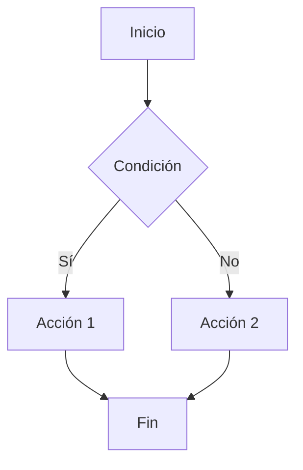
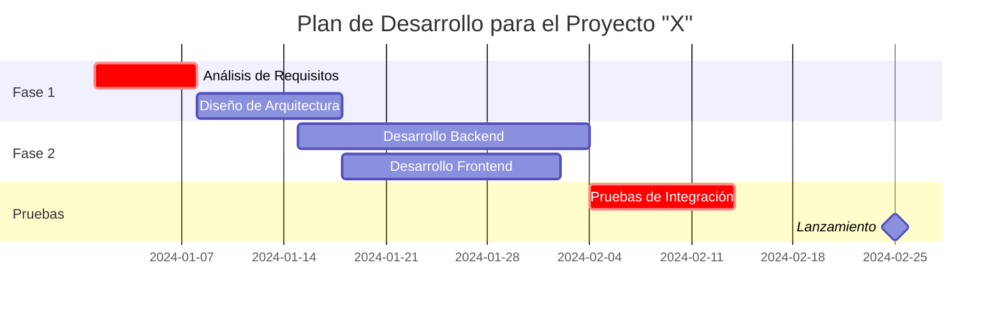
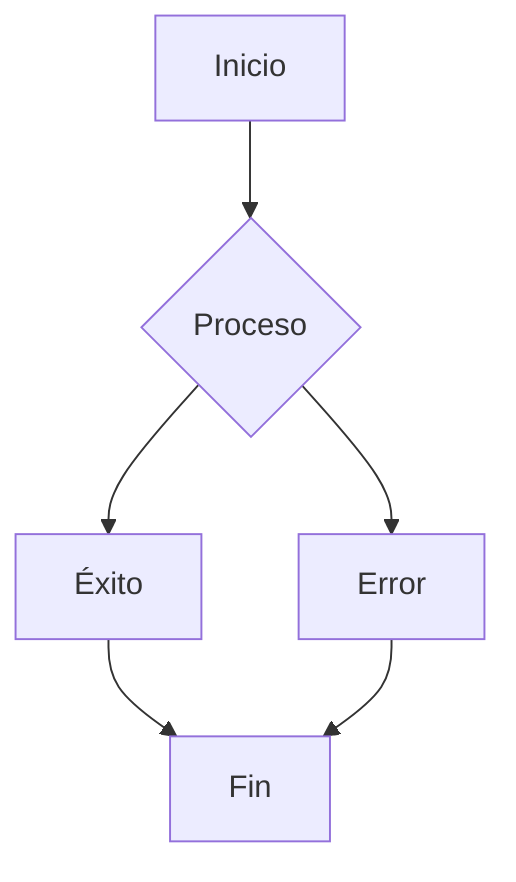
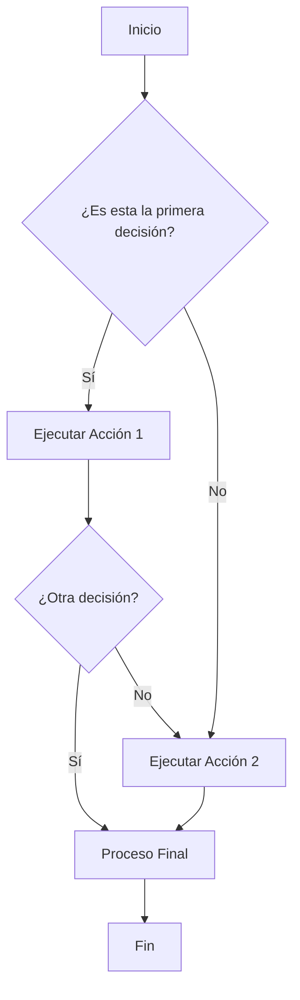
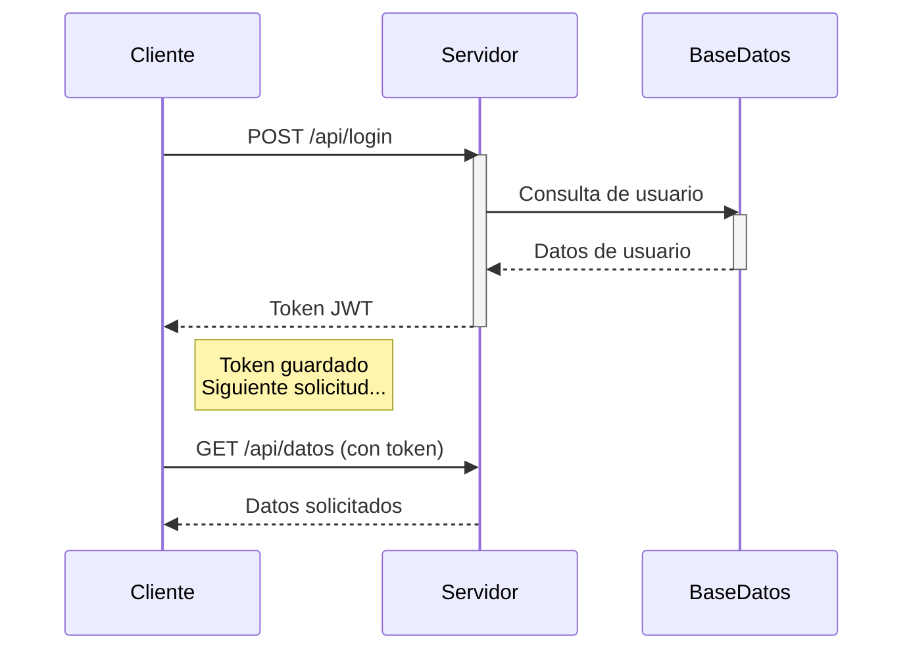
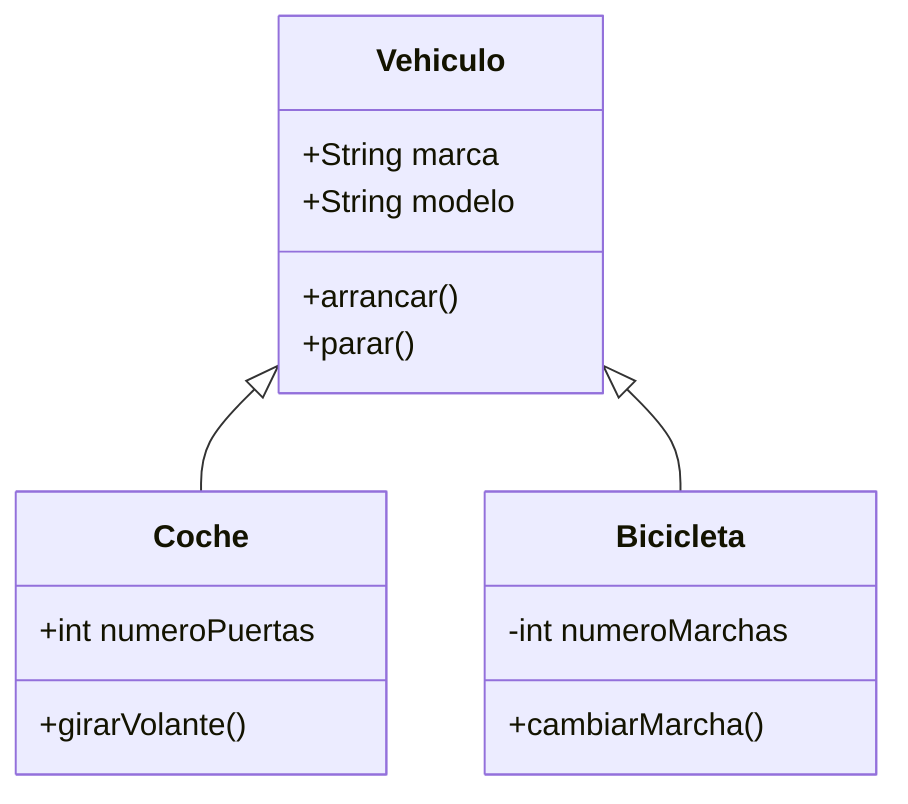
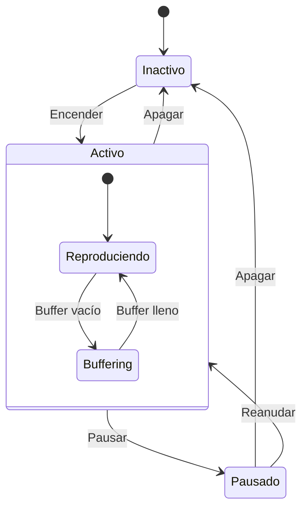
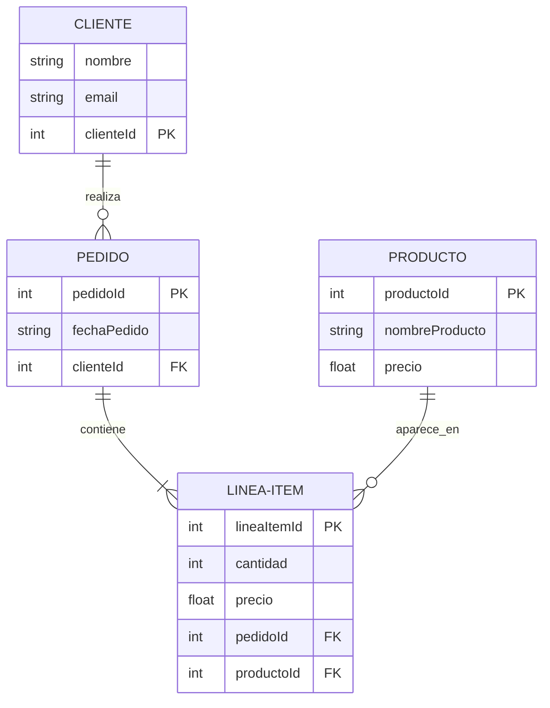
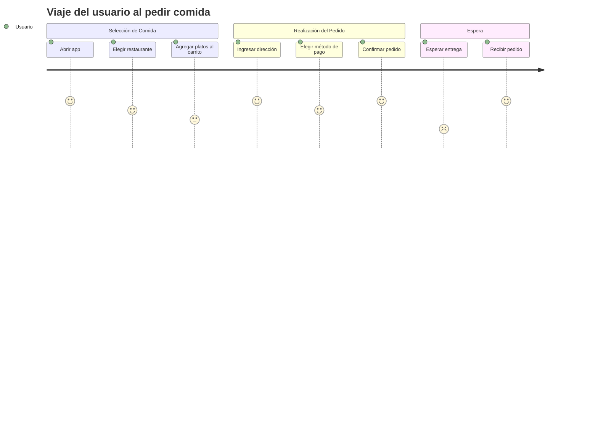
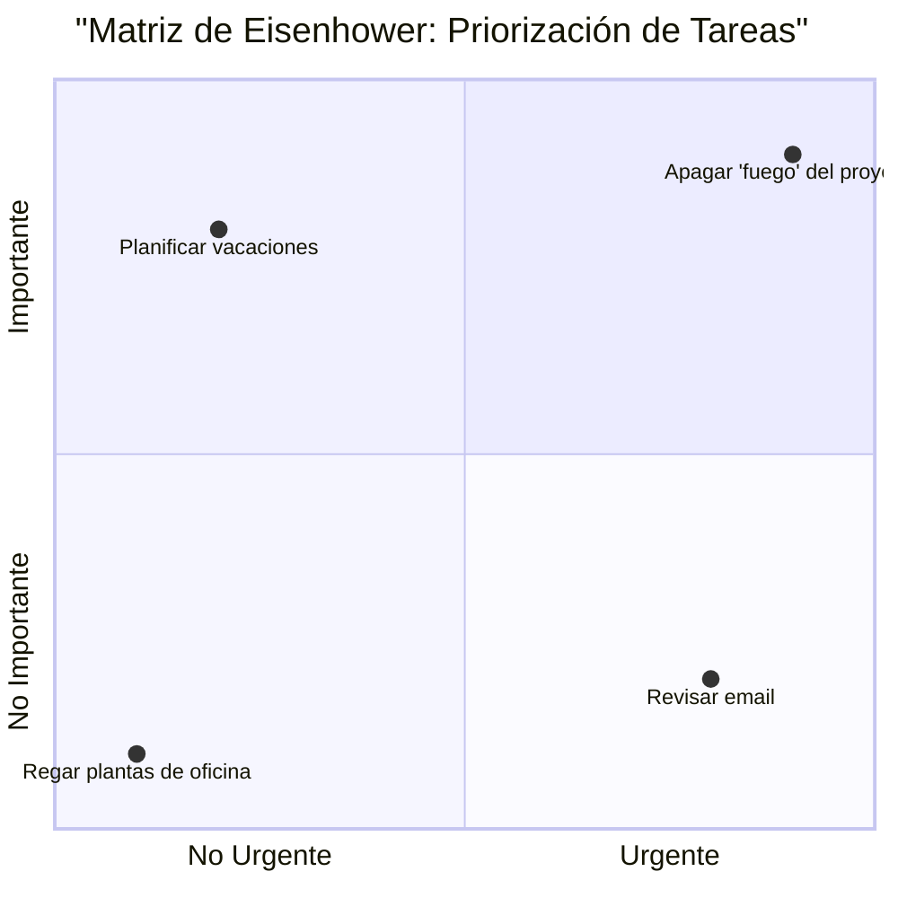

# ¡Bienvenido al Convertidor de Markdown a PDF!

Este es un documento Markdown de ejemplo con soporte para varios elementos.

## Fórmulas Matemáticas

Fórmula en línea: $E = mc^2$

Fórmula en bloque:
$\int_{-\infty}^{\infty} e^{-x^2} dx = \sqrt{\pi}$

## Diagramas Mermaid



## Diagrama de Gantt

Planificación de proyectos y seguimiento de cronogramas.



## Listas y Formato

- **Texto en negrita**
- *Cursiva*
- `código`
- [Enlace](https://example.com)

## Tabla

| Columna 1 | Columna 2 | Columna 3 |
|-----------|-----------|-----------|
| Dato 1    | Dato 2    | Dato 3    |
| Dato 4    | Dato 5    | Dato 6    |

## Conclusión

Este convertidor soporta:
- Marcado Markdown
- Fórmulas matemáticas LaTeX
- Diagramas Mermaid
- Idioma español
- Exportación a PDF


# Guía Completa de Markdown: Todos los Elementos de Sintaxis

Este documento demuestra todas las capacidades de Markdown para probar la conversión a PDF.

## 1. Encabezados

# Encabezado Nivel 1
## Encabezado Nivel 2
### Encabezado Nivel 3
#### Encabezado Nivel 4
##### Encabezado Nivel 5
###### Encabezado Nivel 6

---

## 2. Formato de Texto

**Texto en negrita** y __negrita alternativa__

*Cursiva* y _cursiva alternativa_

***Cursiva negrita*** y ___cursiva negrita alternativa___

~~Texto tachado~~

Superíndice: X^2^ + Y^3^

Subíndice: H~2~O

==Texto resaltado==

> **Nota**: Este es texto resaltado con formato

---

## 3. Listas

### Listas Desordenadas

- Elemento de lista 1
- Elemento de lista 2
  - Elemento anidado 2.1
  - Elemento anidado 2.2
    - Elemento profundamente anidado
- Elemento de lista 3

### Listas Ordenadas

1. Primer elemento
2. Segundo elemento
   1. Ordenado anidado
   2. Otro anidado
3. Tercer elemento

### Lista de Tareas

- [x] Tarea completada
- [ ] Tarea incompleta
- [ ] Otra tarea

---

## 4. Enlaces e Imágenes

### Enlaces

[Enlace regular](https://example.com)

[Enlace con título](https://example.com "Texto de tooltip")

[Enlace relativo a pdf](/documento.pdf)

[Enlace de correo](mailto:test@example.com)

### Imágenes

<!--  -->

 *Pie de imagen*

---

## 5. Tablas

### Tabla Simple

| Encabezado 1 | Encabezado 2 | Encabezado 3 |
|--------------|--------------|--------------|
| Celda 1      | Celda 2      | Celda 3      |
| Celda 4      | Celda 5      | Celda 6      |

### Tabla con Alineación

| Izquierda    | Centro       | Derecha      |
|:-------------|:------------:|-------------:|
| alineado     | alineado     | alineado     |
| izquierda    | centro       | derecha      |
| texto        | texto        | texto        |

### Tabla Compleja

| Producto | Precio | Cantidad | Total |
|----------|--------|----------|-------|
| Libro    | $15    | 2        | $30   |
| Pluma    | $2     | 5        | $10   |
| **Total** | | | **$40** |

---

## 6. Código

### Código en Línea

Usa `console.log('Hola Mundo')` para mostrar en consola.

### Bloque de Código

```javascript
function fibonacci(n) {
    if (n <= 1) return n;
    return fibonacci(n - 1) + fibonacci(n - 2);
}

// Comentario de código
console.log(fibonacci(10));
```

```python
def factorial(n):
    if n == 0:
        return 1
    else:
        return n * factorial(n-1)

print(factorial(5))
```

```html
<!DOCTYPE html>
<html>
<head>
    <title>Ejemplo HTML</title>
</head>
<body>
    <h1>¡Hola, Mundo!</h1>
</body>
</html>
```

---

## 7. Citas

> Esta es una cita simple. Puede contener múltiples líneas de texto y se mostrará como un bloque de cita.

> ## Cita con Encabezado
> Esta es una cita que contiene un encabezado y otros elementos Markdown.
> 
> - Elemento de lista en cita
> - Otro elemento
>
> `Código en cita`

> Cita anidada
>> Esta es una cita anidada
>>> Anidamiento aún más profundo

---

## 8. Reglas Horizontales

Texto sobre la regla

---

Texto entre reglas

***

Otro texto

___

---

## 9. Caracteres Especiales

Escapando caracteres especiales: \*asteriscos\*, \# hashtag, \[enlace\]

Entidades HTML: &copy; &trade; &reg; &amp; &lt; &gt;

---

## 10. Fórmulas Matemáticas

Fórmula en línea: $E = mc^2$

```
Fórmula en bloque:
$$
\int_{-\infty}^{\infty} e^{-x^2} dx = \sqrt{\pi}
$$
```

---

## 11. Definiciones

Término 1
: Definición del primer término

Término 2
: Definición del segundo término, que puede abarcar múltiples líneas y contener **formato**

---

## 12. Notas al Pie

Aquí hay una oración con una nota al pie.[^1] Y aquí hay otra nota al pie.[^2]

[^1]: Esta es la primera nota al pie. Puede contener múltiples líneas y formato.
[^2]: Esta es la segunda nota al pie con un [enlace](https://example.com).

---

## 13. Diagramas (si están soportados)



---

## 14. Ejemplo Complejo Combinando Elementos

### Proyecto "Alfa"

> **Estado**: En Desarrollo ⚠️

#### Tareas Principales:
- [x] Investigación de mercado
- [x] Crear prototipo
- [ ] Pruebas del producto
- [ ] Lanzamiento

#### Equipo:

| Rol | Nombre | Contactos |
|-----|--------|-----------|
| Gerente | Juan Pérez | [juan@example.com](mailto:juan@example.com) |
| Desarrollador | María García | [maria@example.com](mailto:maria@example.com) |
| Diseñador | Ana López | [ana@example.com](mailto:ana@example.com) |

#### Detalles Técnicos:

```python
class Proyecto:
    def __init__(self, nombre, estado):
        self.nombre = nombre
        self.estado = estado
    
    def obtener_info(self):
        return f"Proyecto: {self.nombre}, Estado: {self.estado}"

proyecto = Proyecto("Alfa", "activo")
print(proyecto.obtener_info())
```

**Presupuesto**: $50,000 
**Cronograma**: 6 meses 
**Prioridad**: Alta 🔥

---

## Conclusión

Este documento demuestra casi todas las capacidades de sintaxis de Markdown. Al convertir a PDF, es importante verificar:

1. **Preservación de estructura** de encabezados
2. **Visualización correcta** de tablas y listas
3. **Formato de código y fórmulas matemáticas**
4. **Funcionalidad de enlaces e imágenes**
5. **Soporte de caracteres especiales y elementos**

> **Nota**: Algunas características avanzadas (diagramas, fórmulas matemáticas) pueden requerir manejadores especiales o plugins.

---
*Markdown a PDF*  
*Versión 1.0*


¡Por supuesto! Aquí hay una colección de ejemplos de diferentes tipos de diagramas creados con Mermaid, desde simples hasta más complejos.

### 1. Diagrama de Flujo

Perfecto para describir algoritmos, procesos o rutas de decisión.



---

### 2. Diagrama de Secuencia

Muestra interacciones de objetos a lo largo del tiempo. Excelente para visualizar APIs, llamadas de métodos.



---

### 3. Diagrama de Clases

Forma estándar de visualizar la estructura de sistemas orientados a objetos.



---

### 4. Diagrama de Estados

Muestra máquinas de estados finitos y cómo un objeto transiciona de un estado a otro.



---

### 5. Diagrama de Relación de Entidades

Usado para diseño de bases de datos.



---

### 6. Diagrama de Viaje del Usuario

Muestra los pasos que toma un usuario para lograr un objetivo en tu producto.



---

### 7. Diagrama de Gantt

Planificación de proyectos y seguimiento de cronogramas.


---

### 8. Gráfico de Cuadrantes

Excelente para priorización (ej., Matriz de Eisenhower).



### ¿Cómo Usar Esto?

1.  **Editores en Línea:** La forma más rápida es usar un editor en línea como [Mermaid Live Editor](https://mermaid.live/).
2.  **Documentación:** Mermaid se integra en muchos sistemas de documentación:
    *   **GitLab/GitHub/Gitea** soportan Mermaid "de fábrica" en archivos Markdown (ej., en `README.md`).
    *   **Google Docs/Notion** a través de plugins.
    *   **Visual Studio Code** con la extensión [Markdown Preview Mermaid Support](https://marketplace.visualstudio.com/items?itemName=bierner.markdown-mermaid).
3.  **Sitios Web:** Puedes conectar la biblioteca Mermaid.js a tu página.

Mermaid es una herramienta de visualización poderosa y versátil que te permite mantener diagramas en el mismo repositorio que tu código y actualizarlos fácilmente.
