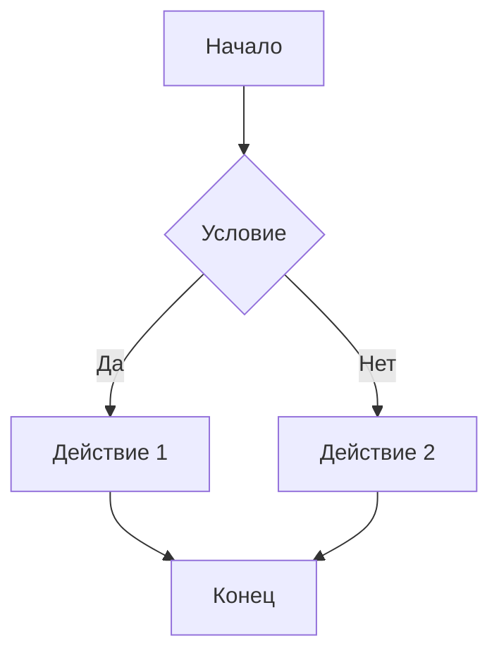
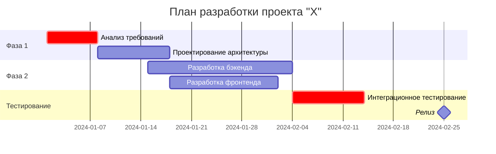
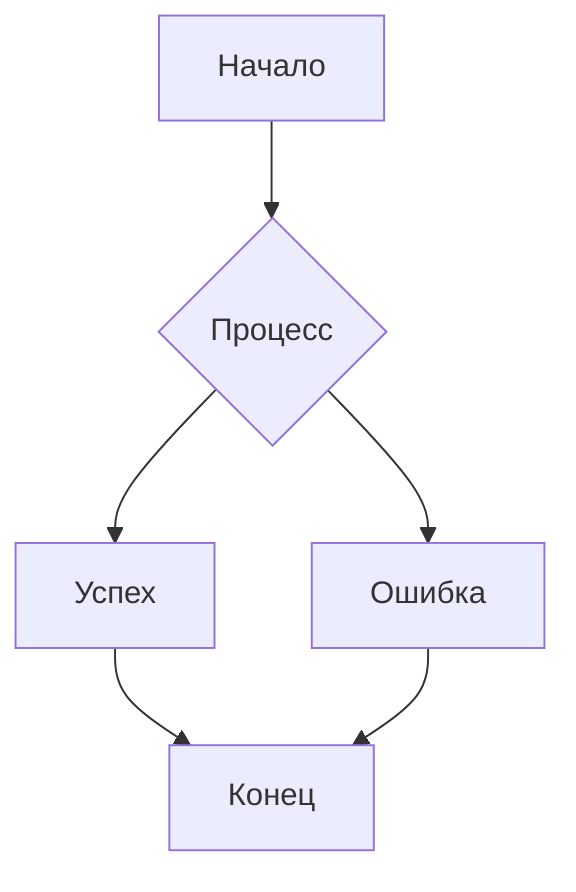
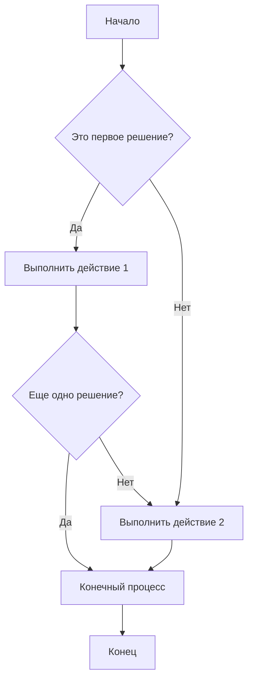
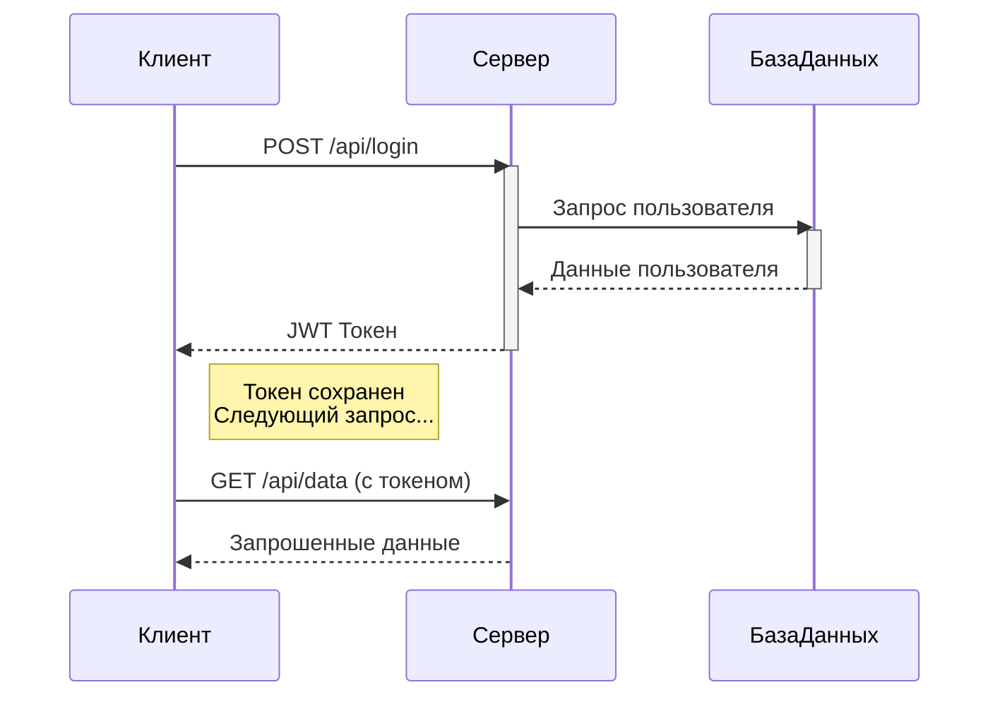
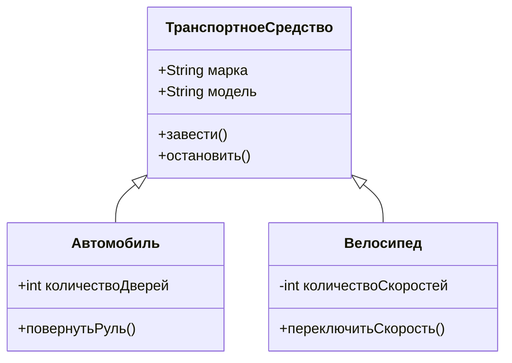
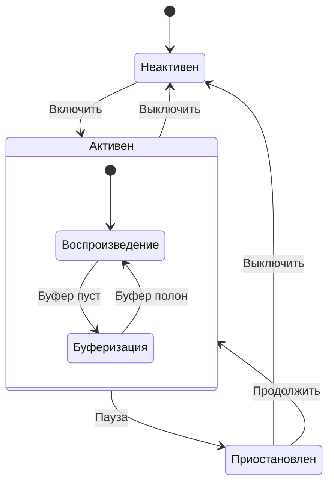
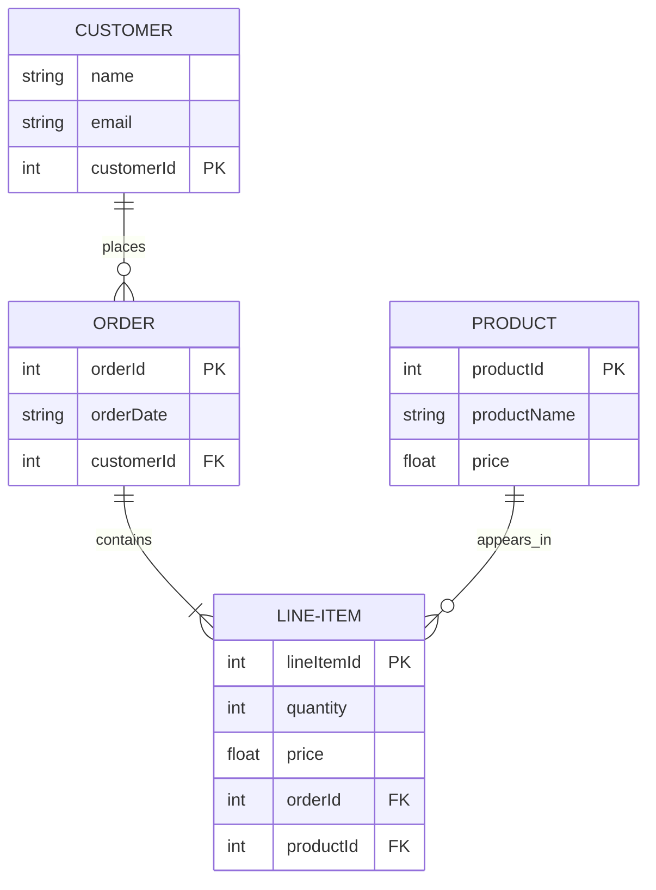
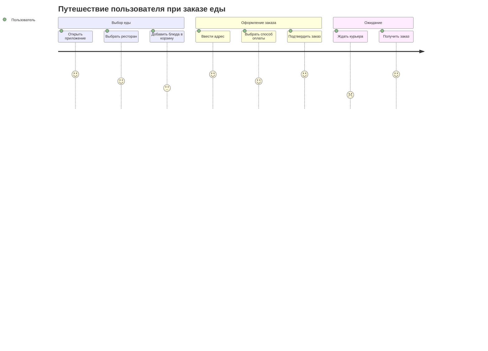
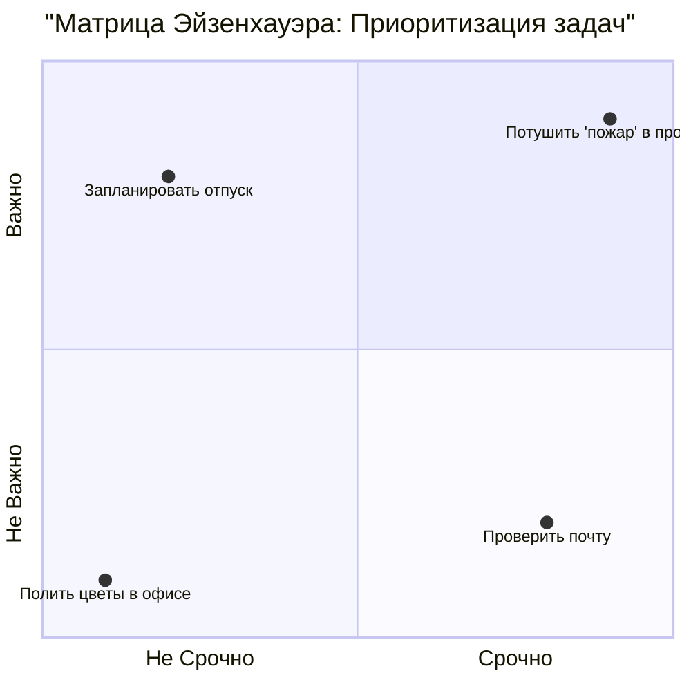

# Добро пожаловать в Markdown to PDF конвертер!

Это **пример** Markdown документа с поддержкой различных элементов.

## Математические формулы

Встроенная формула: $E = mc^2$

Блочная формула:
$\int_{-\infty}^{\infty} e^{-x^2} dx = \sqrt{\pi}$

## Диаграммы Mermaid



## Диаграмма Ганта (Gantt Diagram)

Планирование проектов и отслеживание сроков.



## Списки и форматирование

- **Жирный текст**
- *Курсив*
- `код`
- [Ссылка](https://example.com)

## Таблица

| Колонка 1 | Колонка 2 | Колонка 3 |
|-----------|-----------|-----------|
| Данные 1  | Данные 2  | Данные 3  |
| Данные 4  | Данные 5  | Данные 6  |

## Заключение

Этот конвертер поддерживает:
- Markdown разметку
- Математические формулы LaTeX
- Диаграммы Mermaid
- Русский язык
- Экспорт в PDF


# Полное Руководство по Markdown: Все Элементы Синтаксиса

Этот документ демонстрирует все возможности Markdown для тестирования преобразования в PDF.

## 1. Заголовки

# Заголовок 1 уровня
## Заголовок 2 уровня
### Заголовок 3 уровня
#### Заголовок 4 уровня
##### Заголовок 5 уровня
###### Заголовок 6 уровня

---

## 2. Форматирование текста

**Жирный текст** и __альтернативный жирный__

*Курсив* и _альтервативный курсив_

***Жирный курсив*** и ___альтернативный жирный курсив___

~~Зачеркнутый текст~~

Верхний индекс: X^2^ + Y^3^

Нижний индекс: H~2~O

==Выделенный текст==

> **Примечание**: Это выделенный текст с форматированием

---

## 3. Списки

### Неупорядоченные списки

- Элемент списка 1
- Элемент списка 2
  - Вложенный элемент 2.1
  - Вложенный элемент 2.2
    - Глубоко вложенный элемент
- Элемент списка 3

### Упорядоченные списки

1. Первый элемент
2. Второй элемент
   1. Вложенный упорядоченный
   2. Еще один вложенный
3. Третий элемент

### Список задач

- [x] Завершенная задача
- [ ] Незавершенная задача
- [ ] Еще одна задача

---

## 4. Ссылки и изображения

### Ссылки

[Обычная ссылка](https://example.com)

[Ссылка с title](https://example.com "Всплывающая подсказка")

[Относительная ссылка на pdf](/document.pdf)

[Ссылка на email](mailto:test@example.com)

### Изображения

<!--  -->

 *Подпись под изображением*

---

## 5. Таблицы

### Простая таблица

| Заголовок 1 | Заголовок 2 | Заголовок 3 |
|-------------|-------------|-------------|
| Ячейка 1    | Ячейка 2    | Ячейка 3    |
| Ячейка 4    | Ячейка 5    | Ячейка 6    |

### Таблица с выравниванием

| Левый      | Центр      | Правый     |
|:-----------|:----------:|-----------:|
| выровнен   | выровнен   | выровнен   |
| слева      | по центру  | справа     |
| текст      | текст      | текст      |

### Сложная таблица

| Продукт | Цена | Количество | Итого |
|---------|------|------------|-------|
| Книга   | $15  | 2          | $30   |
| Ручка   | $2   | 5          | $10   |
| **Всего** | | | **$40** |

---

## 6. Код

### Встроенный код

Используйте `console.log('Hello World')` для вывода в консоль.

### Блок кода

```javascript
function fibonacci(n) {
    if (n <= 1) return n;
    return fibonacci(n - 1) + fibonacci(n - 2);
}

// Комментарий в коде
console.log(fibonacci(10));
```

```python
def factorial(n):
    if n == 0:
        return 1
    else:
        return n * factorial(n-1)

print(factorial(5))
```

```html
<!DOCTYPE html>
<html>
<head>
    <title>Пример HTML</title>
</head>
<body>
    <h1>Привет, мир!</h1>
</body>
</html>
```

---

## 7. Цитаты

> Это простая цитата. Она может содержать несколько строк текста и будет отображаться как блок цитаты.

> ## Цитата с заголовком
> Это цитата, содержащая заголовок и другие элементы Markdown.
> 
> - Элемент списка в цитате
> - Еще один элемент
>
> `Код в цитате`

> Вложенная цитата
>> Это вложенная цитата
>>> Еще более глубокая вложенность

---

## 8. Горизонтальные разделители

Текст выше разделителя

---

Текст между разделителями

***

Еще один текст

___

---

## 9. Специальные символы

Экранирование специальных символов: \*звездочки\*, \# хештег, \[ссылка\]

Символы HTML: &copy; &trade; &reg; &amp; &lt; &gt;

---

## 10. Математические формулы

Встроенная формула: $E = mc^2$

```
Блочная формула:
$$
\int_{-\infty}^{\infty} e^{-x^2} dx = \sqrt{\pi}
$$
```

---

## 11. Определения

Термин 1
: Определение первого термина

Термин 2
: Определение второго термина, которое может занимать несколько строк и содержать **форматирование**

---

## 12. Сноски

Вот предложение со сноской.[^1] А вот еще одна сноска.[^2]

[^1]: Это первая сноска. Она может содержать несколько строк и форматирование.
[^2]: Это вторая сноска с [ссылкой](https://example.com).

---

## 13. Диаграммы (если поддерживается)



---

## 14. Сложный пример комбинации элементов

### Проект "Альфа"

> **Статус**: В разработке ⚠️

#### Основные задачи:
- [x] Исследование рынка
- [x] Создание прототипа
- [ ] Тестирование продукта
- [ ] Релиз

#### Команда:

| Роль | Имя | Контакты |
|------|-----|----------|
| Менеджер | John Smith | [ivan@example.com](mailto:john@example.com) |
| Разработчик | Maria Sidr | [maria@example.com](mailto:maria@example.com) |
| Дизайнер | Tet Piya | [alexey@example.com](mailto:tet@example.com) |

#### Технические детали:

```python
class Project:
    def __init__(self, name, status):
        self.name = name
        self.status = status
    
    def get_info(self):
        return f"Проект: {self.name}, Статус: {self.status}"

project = Project("Альфа", "active")
print(project.get_info())
```

**Бюджет**: $50,000 
**Сроки**: 6 месяцев 
**Приоритет**: Высокий 🔥

---

## Заключение

Этот документ демонстрирует практически все возможности синтаксиса Markdown. При преобразовании в PDF важно проверить:

1. **Сохранение структуры** заголовков
2. **Корректное отображение** таблиц и списков
3. **Форматирование** кода и математических формул
4. **Работа ссылок** и изображений
5. **Поддержка специальных** символов и элементов

> **Примечание**: Некоторые расширенные функции (диаграммы, математические формулы) могут требовать специальных обработчиков или плагинов.

---
*Markdown в PDF*  
*Версия 1.0*


Конечно! Вот подборка примеров диаграмм разных типов, созданных с помощью Mermaid, от простых к более сложным.

### 1. Блок-схема (Flowchart)

Идеально для описания алгоритмов, процессов или путей принятия решений.



---

### 2. Последовательность (Sequence Diagram)

Показывает взаимодействие объектов во времени. Отлично подходит для визуализации API, вызовов методов.



---

### 3. Диаграмма классов (Class Diagram)

Стандартный способ визуализации структуры объектно-ориентированной системы.



---

### 4. Диаграмма состояния (State Diagram)

Показывает конечные автоматы и то, как объект переходит из одного состояния в другое.



---

### 5. Диаграмма сущность-связь (ER Diagram)

Используется для проектирования баз данных.



---

### 6. Путешествие пользователя (User Journey Diagram)

Показывает шаги, которые пользователь проходит для достижения цели в вашем продукте.



---

### 7. Ганта диаграмма (Gantt Diagram)

Планирование проектов и отслеживание сроков.


---

### 8. Квадрантная диаграмма (Quadrant Chart)

Отлично подходит для приоритизации (например, матрица Eisenhower).



### Как это использовать?

1.  **Онлайн-редакторы:** Самый быстрый способ — использовать онлайн-редактор, такой как [Mermaid Live Editor](https://mermaid.live/).
2.  **Документация:** Mermaid интегрируется во многие системы для документирования:
    *   **GitLab/GitHub/Gitea** поддерживают Mermaid "из коробки" в Markdown-файлах (например, в `README.md`).
    *   **Документы Google/Notion** через плагины.
    *   **Visual Studio Code** с расширением [Markdown Preview Mermaid Support](https://marketplace.visualstudio.com/items?itemName=bierner.markdown-mermaid).
3.  **Веб-сайты:** Можно подключить библиотеку Mermaid.js на свою страницу.

Mermaid — это мощный и универсальный инструмент для визуализации, который позволяет держать диаграммы в одном репозитории с кодом и легко их обновлять.